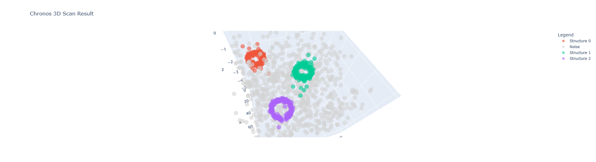
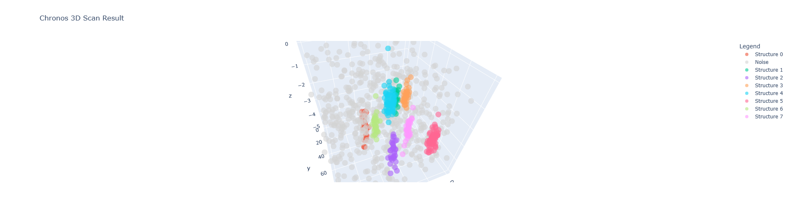
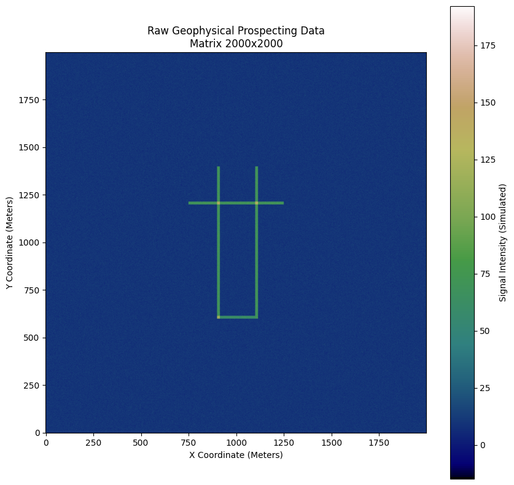
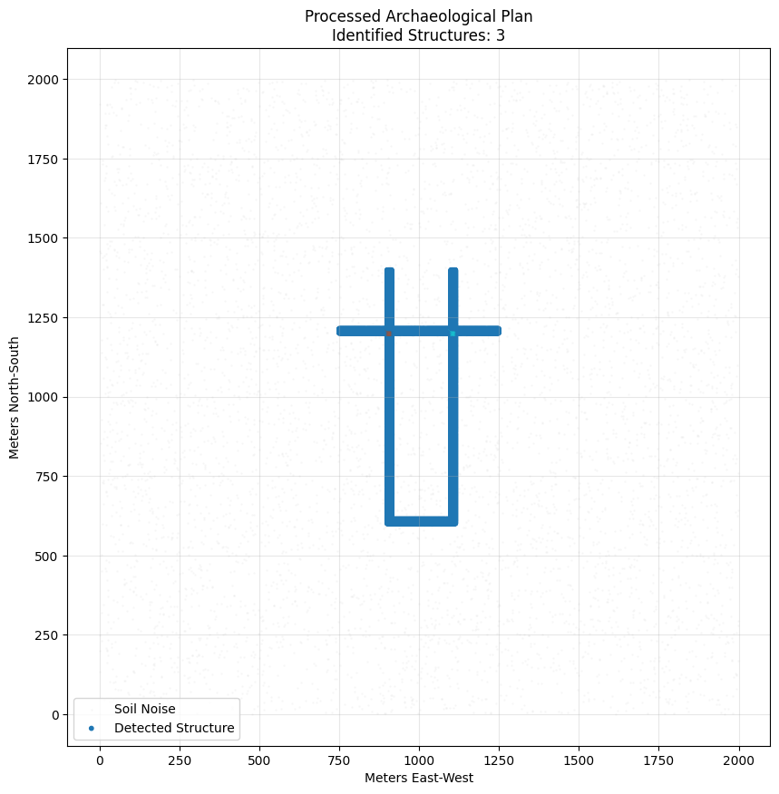
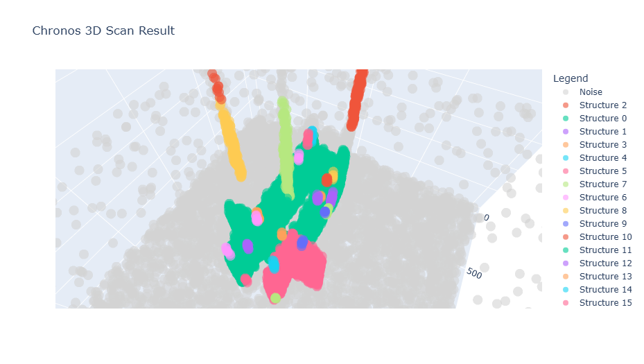
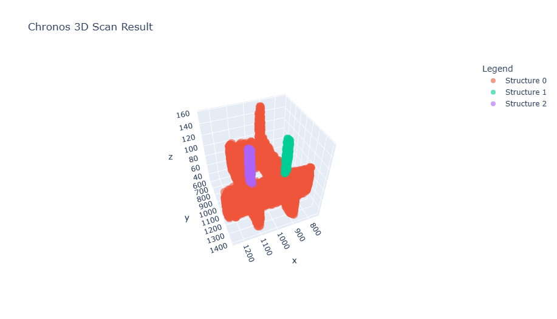
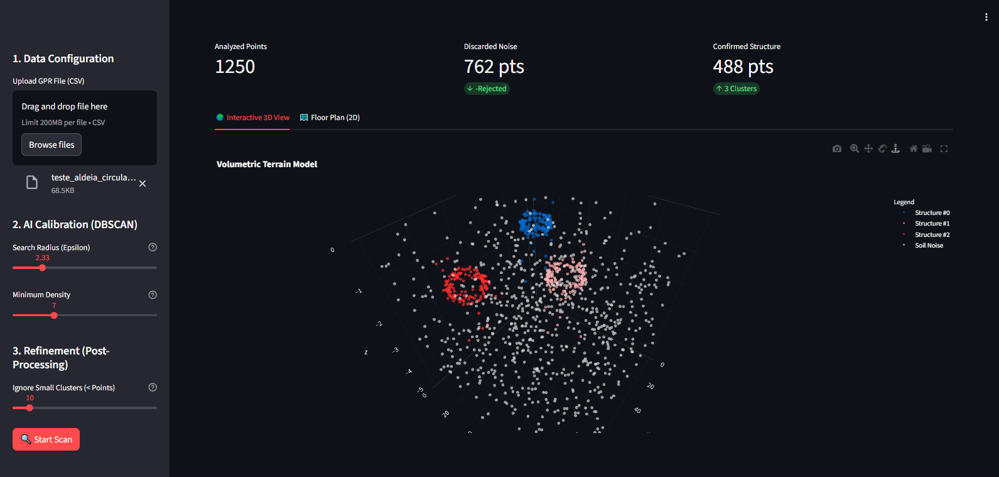

> 🇧🇷 **Para ler a versão em Português deste projeto, [clique aqui](README.pt-br.md).**

---

# 🏛️ Chronos: Archaeological AI Detection System


[](https://chronos-ai-archeology.streamlit.app/)

> **🔴 Live Demo:** Click the "Streamlit" badge above or [access the dashboard here](https://chronos-ai-archeology.streamlit.app/) to interact with the 2D and 3D model in real-time.

> **"Technology does not reinvent the past, but gives us new lenses to see it."**

## 📖 About the Project

**Chronos** is an Artificial Intelligence system focused on **Computational Archaeology**. The project utilizes Unsupervised Machine Learning algorithms (**DBSCAN**) to identify structural patterns (walls, foundations, necropolises) hidden within noisy geophysical data.

The goal is to simulate the processing of real field data — such as **GPR** (Ground Penetrating Radar) and **LIDAR** — automating the detection of archaeological sites and generating precise excavation reports.

---

## 🇻🇦 Motivation: The Vatican Challenge

One of the major inspirations for the development of *Chronos* was the archaeological complexity faced by institutions like the Vatican. **St. Peter's Basilica** sits upon millennia of stratified history, where physical excavations are risky or impossible.

The project seeks to answer: **How to map the sacred without touching it?**
* **Non-Invasive Archaeology:** Processing radar signals to see through marble.
* **Preservation:** Identification of voids and structures without the need for destructive excavation.

---

## 🛠️ Technologies and Inspirations

This repository serves as a study guide on technologies that are revolutionizing history (inspired by the channel [*Estranha História*](https://www.youtube.com/@henriquecaldeira), by Prof. Dr. Henrique Caldeira):

* **LIDAR (*Light Detection and Ranging*):** 3D terrain modeling via laser to virtually remove vegetation.
* **XRF (*X-Ray Fluorescence*):** Chemical analysis of materials via X-rays.
* **DBSCAN (Main Algorithm):** Spatial density-based clustering to separate "Signal" (Walls) from "Noise" (Loose stones).

---

## 📂 Repository Structure

The project is divided into three progressive modules:

### 0. [Chronos Part 0: The Generator (Genesis)](Notebooks/en/Chronos_Archaeology_Exploration_Analysis.ipynb)
The project's foundation made for Data Analysis. Before analysis, we engineer a "Controlled Universe" to validate our hypotheses.
* **Stratigraphy Simulation:** Stochastic algorithm applying the *Law of Superposition* (Depth $\propto$ Age).
* **"Ground Truth" Injection:** Artificial creation of a "Royal Tomb" (Gold) concealed within noise to validate model efficacy.
* **AI Benchmarking:** Practical demonstration of **K-Means** limitations (geometric bias) vs. the necessity of **DBSCAN** (density-based) for archaeology.

### 1. [Chronos Part I: Vector Fundamentals](Notebooks/en/Chronos_Archaeology_Part_I.ipynb)
Focused on the introduction to computational geometry and linear pattern detection.
* **Scenarios:** Inca Wall (Sine wave), Circular Village, and Necropolis.
* **Technique:** Vector data ($X, Y, Z$).
* **Visualization:** Scatter plots and Folium Maps.
**📸 Part I Gallery:**
<p align="center">
  
  
  <br>
  <em>Fig 1: Detection of circular structures (Villages) and linear clusters (Necropolis).</em>
</p>

### 2. [Chronos Part II: Advanced Simulation (Raster)](Notebooks/en/Chronos_Archaeology_Part_II.ipynb)
Simulation of a real high-resolution geophysical survey (GPR).
* **Scenario:** A "Subterranean Basilica" hidden in a 4-million-point matrix.
* **Pipeline:**
    1.  **Raster Ingestion:** Image processing and signal histograms.
    2.  **Vectorization:** Heatmap to Vector conversion.
    3.  **`ChronosAnalyzer` Class:** Object-oriented architecture for processing.
    4.  **Business Intelligence:** Automatic generation of reports with areas ($m^2$) and excavation coordinates.

---

## 📊 Visual Results

> **Note:** GitHub renders static images below. To interact with the 3D plots (rotate/zoom), please open the notebooks in **Google Colab**.

The system transforms raw geophysical data into actionable engineering plans:

### 1. From Signal to Map (The Engineering Pipeline)
Comparison between the raw GPR input (raster) and the final vector blueprint generated by Chronos.

| Raw Data (Input) | Final Archeological Plan (Output) |
|:---:|:---:|
|  |  |
| *Noisy 2D Heatmap (Simulated GPR)* | *Clean Vector Map ready for excavation* |

### 2. The AI in Action (DBSCAN Processing)
How the algorithm visualizes data in 3D space to separate structural walls from geological noise.

| Phase I: Detection (Noisy) | Phase II: Refinement (Clean) |
|:---:|:---:|
|  |  |
| *DBSCAN identifying clusters amidst noise.* | *Final 3D Model after heuristic filtering.* |

---

## 🎮 Interactive Web App (Deployment)

To bridge the gap between code and field operations, Chronos includes a production-ready dashboard built with **Streamlit**. This tool allows archaeologists to interact with the algorithm without writing a single line of Python.



### Key Features:
* **Real-time Tuning:** Adjust `Epsilon` and `Density` sliders to see immediate changes in the 3D model.
* **Heuristic Filter:** Control the post-processing threshold to clean debris dynamically.
* **Export:** Download the processed vector data (`.csv`) directly from the browser.

### 🚀 How to Run the App
To launch the dashboard locally:

1.  Install Streamlit:
    ```bash
    pip install streamlit
    ```
2.  Run the application (Choose your language):
    ```bash
    # For English Version
    streamlit run app/app_en.py
    
    # Para Versão em Português
    streamlit run app/app_pt.py
    ```

---

## 🚀 How to Run

This project was developed to run on **Google Colab** or **Jupyter Notebook**.

### Prerequisites
```bash
pip install pandas numpy scikit-learn plotly folium matplotlib
```

---

## 👨‍💻 Author

**Isaac Davi** *Developer*

Built as a portfolio project exploring the intersection of **History** and **Technology**.  
Feel free to reach out for collaborations or questions.

---

## 📄 License

This project is intended for **academic and educational purposes**.

* **Free to use:** You may modify and distribute this code for learning and research.
* **Synthetic Data:** Please note that the archaeological data generated in this pipeline is **simulated** (procedural generation) and does not represent real protected sites.

---
