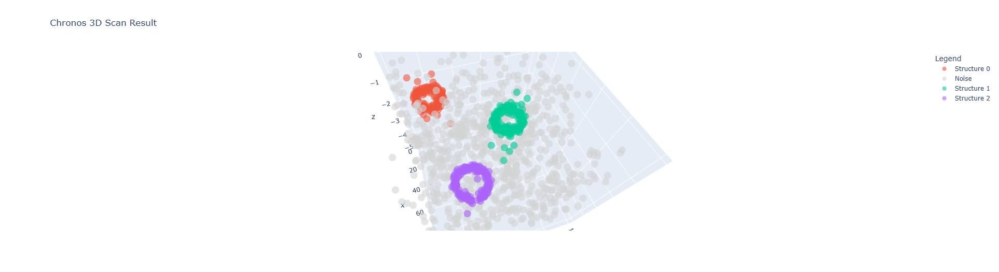
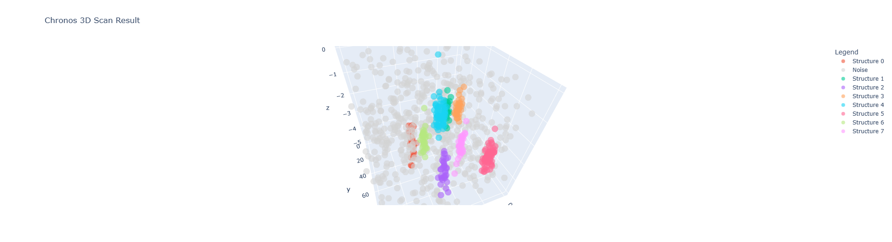
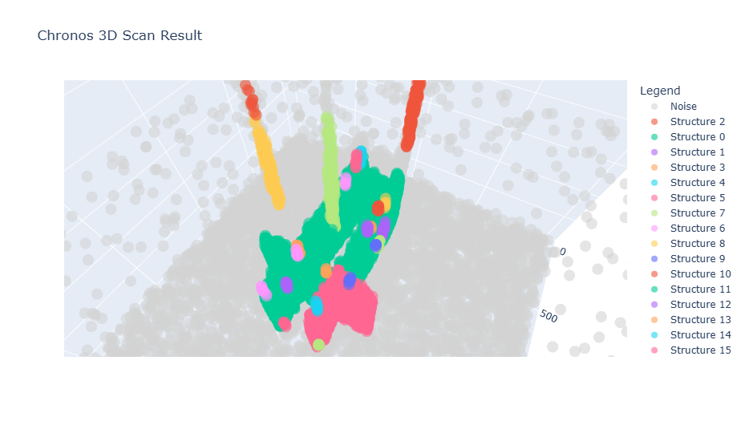
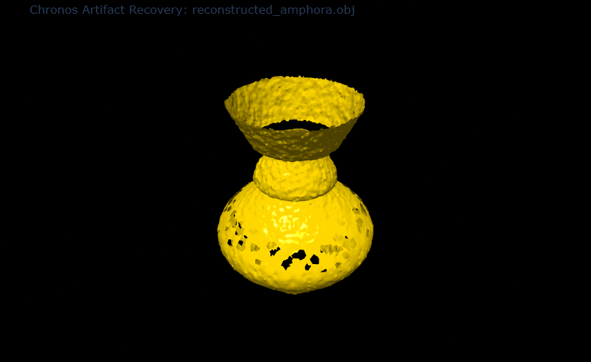
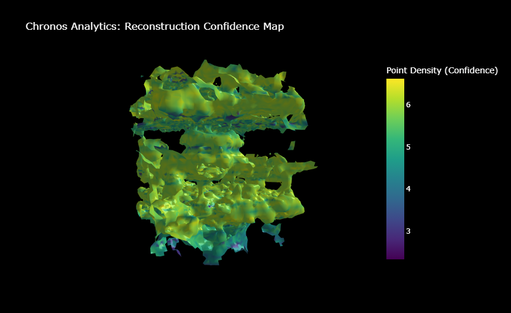
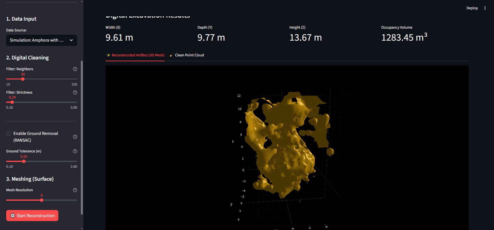

> 🇧🇷 **Para ler a versão em Português deste projeto, [clique aqui](README.pt-br.md).**

---

# 🏛️ Chronos: Archaeological AI Detection System


[](https://chronos-ai-archeology.streamlit.app/)


> **🔴 Live Demo:** Click the "Streamlit" badge above or [access the dashboard here](https://chronos-ai-archeology.streamlit.app/) to interact with the 2D and 3D model in real-time.

> **"Technology does not reinvent the past, but gives us new lenses to see it."**

## 📖 About the Project

**Chronos** is an Artificial Intelligence system focused on **Computational Archaeology**. The project uses unsupervised machine learning (**DBSCAN**) to identify structural patterns — walls, foundations, necropolises — hidden inside noisy geophysical data.

The goal is to simulate the processing of real field data, such as **GPR** (Ground Penetrating Radar) and **LIDAR**, automating the detection of archaeological features and generating excavation reports.

> ⚠️ **All data in this repository is synthetic.** Every result below is measured against ground truth that the simulator generated by construction. That makes the metrics reliable as a measure of *algorithm behaviour*, and **not** as a measure of field performance. Validation on real survey data is the next milestone (v3.0), and the distinction is kept explicit until then.

---

## 🇻🇦 Motivation: The Vatican Challenge

One inspiration for *Chronos* was the archaeological complexity faced by institutions like the Vatican. **St. Peter's Basilica** sits on millennia of stratified history, where physical excavation is risky or impossible.

The project asks: **how do you map the sacred without touching it?**

* **Non-invasive archaeology:** processing radar signals to see through marble.
* **Preservation:** identifying voids and structures without destructive excavation.

> 📌 **A point of precision:** the necropolis under St. Peter's — the [*Scavi*][https://visite.basilicasanpietro.va/en/booking/necropolivaticana] — was excavated between 1940 and 1949 and is extensively published. It is a **precedent**, not an unexplored frontier. Non-invasive *monitoring* of a known, fragile site is a real use case: excavated sites need monitoring against subsidence and structural degradation.

---

## 🛠️ Technologies and Inspirations

This repository doubles as a study guide on technologies changing how we read history (inspired by the channel [*Estranha História*](https://www.youtube.com/@henriquecaldeira), by Prof. Dr. Henrique Caldeira):

* **LIDAR (*Light Detection and Ranging*):** 3D terrain modelling via laser, to virtually remove vegetation.
* **XRF (*X-Ray Fluorescence*):** chemical analysis of materials via X-rays. Note that **GPR cannot do this** — it measures dielectric contrast, not composition. Any material attribution in this pipeline is a hypothesis awaiting XRF or direct analysis.
* **DBSCAN:** density-based spatial clustering, separating signal (walls) from noise (loose stones).
* **Computational geometry (Open3D):** from vector points to 3D digital twins via Poisson reconstruction and convex hulls.

---

## 📂 Repository Structure

```
Chronos-AI/
├── notebooks/
│   ├── en/          Chronos_Archaeology_{Exploration_Analysis, Part_I, Part_II, Part_III}.ipynb
│   └── pt-br/       Chronos_Arqueologia_{Analise_Exploratoria, Parte_I, Parte_II, Parte_III}.ipynb
├── app/             app_pt.py, app_en.py, chronos_core.py
├── data/            synthetic datasets (.csv, .las)
├── assets/          figures and graphs
├── docs/            LICENSE-COMMERCIAL.md
├── requirements.txt / requirements-dev.txt
└── README.md / README.pt-br.md / LICENSE
```

### 0. [Part 0: The Generator (Genesis)](notebooks/en/Chronos_Archaeology_Exploration_Analysis.ipynb)
The foundation. Before any analysis, we engineer a controlled universe to validate hypotheses against.
* **Stratigraphy simulation:** stochastic algorithm applying the *Law of Superposition* (depth ∝ age).
* **Ground truth injection:** a "Royal Tomb" concealed inside noise, so model efficacy can be *measured* rather than asserted.
* **AI benchmarking:** demonstration of **K-Means** limitations (geometric bias) against the need for **DBSCAN** (density-based).

### 1. [Part I: Vector Fundamentals](notebooks/en/Chronos_Archaeology_Part_I.ipynb)
Computational geometry and linear pattern detection.
* **Scenarios:** Inca wall (sine wave), circular village, necropolis.
* **Technique:** vector data (X, Y, Z), all three axes in metres.
* **Visualisation:** scatter plots and Folium maps, with latitude-corrected georeferencing.

**📸 Part I Gallery:**
<p align="center">
  
  
  <br>
  <em>Fig 1: Detection of circular structures (villages) and linear clusters (necropolis).</em>
</p>

### 2. [Part II: Advanced Simulation (Raster)](notebooks/en/Chronos_Archaeology_Part_II.ipynb)
Simulation of a high-resolution geophysical survey.
* **Scenario:** a subterranean basilica hidden in a 2000 × 2000 pixel matrix — **500 m × 500 m of ground** at the declared scale of 0.25 m/pixel.
* **Pipeline:**
    1. **Raster ingestion:** image processing and signal histograms.
    2. **Thresholding:** Otsu and μ+3σ, scored against the ground-truth mask.
    3. **Vectorisation:** heatmap to vector conversion.
    4. **`ChronosAnalyzer`:** clustering in *space only* — radar intensity is used as a weight, never as a coordinate.
    5. **Reporting:** areas in m², real footprint alongside the bounding box, and excavation coordinates.

### 3. [Part III: Volumetric Reconstruction and Metrology](notebooks/en/Chronos_Archaeology_Part_III.ipynb)
The step to volumetric engineering.
* **Stress test:** a hostile prospecting environment with **25,000 noise points** and a 30% sensor failure rate.
* **Geometric engine (Open3D):** normal estimation with a cloud-derived radius, outward orientation verified against the centroid, and Poisson surface reconstruction with statistical density pruning.
* **Metrology and auditing:** four distinct quantities reported separately — AABB envelope, convex hull, and true volume *when the mesh is closed* — plus a mass scenario table and an algorithmic confidence map.

---

## 🔄 What's new in v2.1

v2.1 is a rigour release. The pipeline now **measures** its own output at every
stage instead of describing it, and the physical scale of every result is
declared and carried through to the report.

**Evaluation everywhere.** The simulator generates ground truth by construction —
we know which pixels are wall and which points are signal. Every stage now scores
itself against it: precision, recall, IoU, specificity.

**Declared units.** A survey grid is measured in pixels; metres are what you get
after multiplying by a stated scale. `PIXEL_SIZE_M` is now explicit and
propagated all the way to the excavation report.

**Statistics instead of eyeballing.** The detection threshold is chosen by Otsu
or μ+3σ and scored, not fixed by hand. The DBSCAN radius can be suggested from
the k-distance knee. Georeferencing is latitude-corrected.

**Verified claims.** Mesh topology is checked with `is_watertight()` before
anything is said about it. Volumetry reports four distinct quantities — AABB
envelope, oriented box, convex hull and true volume — rather than collapsing them
into one number. Mass is a scenario table across six materials, with the
instrument's limits stated: GPR measures dielectric contrast, not composition.

**A detection stage before reconstruction.** SOR is a density-uniformity filter,
not a detector, so DBSCAN now runs between the filter and Poisson.


---

## 📊 Visual Results

> **Note:** GitHub renders static images below. To interact with the 3D plots, open the notebooks in **Google Colab** — the renderer is now detected at runtime, so they will actually display.

### 1. From Signal to Map

| Raw Data (Input) | Final Archaeological Plan (Output) |
|:---:|:---:|
|  |  |
| *Noisy 2D heatmap (simulated GPR)* | *Clean vector map ready for excavation* |

### 2. The AI in Action (DBSCAN Processing)

| Phase I: Detection (Noisy) | Phase II: Refinement (Clean) |
|:---:|:---:|
|  |  |
| *DBSCAN identifying clusters amidst noise.* | *Final 3D model after heuristic filtering.* |

### 3. Reverse Engineering (Digital Twins and Metrology)

| Surface Reconstruction (Poisson) | Algorithmic Confidence Map |
|:---:|:---:|
|  |  |
| *Surface mesh from low-SNR radar.* | *Yellow indicates strong data support; purple indicates Poisson interpolation.* |

> ⚠️ **These figures are from the previous pipeline and will be regenerated in the future.** They were generated before the detection stage was added, so the mesh is closer to the Poisson envelope of the point cloud than to the artifact itself. Also, the **confidence map measures reconstruction support, not detection certainty** — for detection confidence, bootstrap stability is the correct tool we will use for that.

---

## 🎮 Interactive Web App

Chronos includes a dashboard built with **Streamlit**, so archaeologists, geologists and engineers can use the algorithms without writing Python.

### 📍 Macro-Prospecting (GPR and Raster)


* **Real-time tuning:** `Epsilon` and `Density` control for DBSCAN, with a k-distance knee suggestion.
* **Heuristic filter:** dynamic cleaning of debris and geological noise.
* **Vector export:** download processed coordinates (`.csv`) for topography software.

### 🧊 Micro-Excavation and Digital Twins


* **Industrial ingestion (LIDAR):** drag-and-drop for `.las` / `.laz`, with coordinates centred on load so UTM values do not degrade the Poisson octree.
* **Adaptive downsampling:** voxel size derived from the scene extent rather than hardcoded.
* **Reconstruction:** SOR → DBSCAN detection → Poisson, with topology verified before any claim is printed.
* **Export:** `.ply` (preserves vertex colour, so the confidence map survives) and `.obj` (CAD, 3D printing, VR).

---

## 🚀 How to Run

### ⚠️ Python version — read this first

**Open3D 0.19 publishes wheels for cp38–cp312 only. There is no cp313 wheel.** On Python 3.13 the 3D modules simply cannot install, and Part III will fail with `ModuleNotFoundError: No module named 'open3d'`.

**Use Python 3.10, 3.11 or 3.12.**

```bash
# Linux / macOS
python3.12 -m venv .venv
source .venv/bin/activate

# Windows
py -3.12 -m venv .venv
.\.venv\Scripts\activate

pip install -r requirements.txt
```

Then point Jupyter at that environment:

```bash
pip install ipykernel
python -m ipykernel install --user --name chronos --display-name "Python 3.12 (Chronos)"
```

…and select **Python 3.12 (Chronos)** as the kernel. Running the notebooks against a system-wide 3.13 kernel is the single most common source of errors.

### Running the dashboard

```bash
streamlit run App/app_en.py     # or App/app_pt.py
```

---

## 🗺️ Roadmap (v3.0)

1. **Relief visualisation of real LiDAR** — Sky-View Factor (Zakšek et al. 2011), Local Relief Model (Hesse 2010), Openness (Doneus 2013), via the RVT toolbox. This is the visual language archaeologists actually use, and open national LiDAR (AHN, UK Environment Agency) makes it immediately testable.
2. **Physically realistic GPR** — gprMax (Warren et al. 2016) for FDTD forward modelling, plus the standard processing chain, of which **migration** is the step that collapses hyperbolas into points. Without it you are not looking at a plan.
3. **Deep learning, framed honestly** — U-Net on DTM rasters, following Verschoof-van der Vaart & Lambers (2019). 2D, with labelled open data — not PointNet on synthetic amphorae.


---

## What Chronos does **not** do

Our limits:

- **It does not identify materials.** GPR measures dielectric contrast. Any
  material attribution (ceramic, bronze, stone) is the operator's hypothesis and
  requires XRF, XRD or direct analysis to confirm. The mass scenario table exists
  to make this explicit.
- **It does not date anything.** There is no relationship between geophysical
  response and chronology.
- **It does not replace physical survey.** Every anomaly is a hypothesis until a
  probe confirms or refutes it.
- **It is not field-validated.** Through v2.1, every result concerns synthetic
  data, where ground truth is known by construction. That makes the metrics
  reliable as a measure of *algorithm behaviour*, not as a measure of field
  performance. That validation depends on real data — it is on the roadmap, and
  the distinction must stay explicit until then.

I would like to emphasize that this is an entirely academic project, and that the use of real archaeological data requires **legal authorization**.

Furthermore, the project aims at personal development, learning, and the exploration of technical tools for computational archaeology with AI.

---

## 👨‍💻 Author

**Isaac Davi** — *Developer*

Built as a portfolio project exploring the intersection of **history** and **technology**. Feel free to reach out for collaborations or questions.

---

## 📚 References

### Algorithms in this project

* Ester, M., Kriegel, H.-P., Sander, J. & Xu, X. (1996). A Density-Based Algorithm for Discovering Clusters in Large Spatial Databases with Noise. *Proceedings of KDD-96*, 226–231. — DBSCAN.
* Campello, R. J. G. B., Moulavi, D. & Sander, J. (2013). Density-Based Clustering Based on Hierarchical Density Estimates. *PAKDD 2013*, LNCS 7819, 160–172. — HDBSCAN.
* Kazhdan, M., Bolitho, M. & Hoppe, H. (2006). Poisson Surface Reconstruction. *Symposium on Geometry Processing*, 61–70.
* Kazhdan, M. & Hoppe, H. (2013). Screened Poisson Surface Reconstruction. *ACM Transactions on Graphics* 32(3), 1–13. — the variant Open3D implements.
* Bernardini, F. et al. (1999). The Ball-Pivoting Algorithm for Surface Reconstruction. *IEEE Transactions on Visualization and Computer Graphics* 5(4), 349–359.
* Otsu, N. (1979). A Threshold Selection Method from Gray-Level Histograms. *IEEE Transactions on Systems, Man, and Cybernetics* 9(1), 62–66.
* Satopää, V., Albrecht, J., Irwin, D. & Raghavan, B. (2011). Finding a "Kneedle" in a Haystack: Detecting Knee Points in System Behavior. *ICDCS Workshops*, 166–171. — k-distance knee.
* Fischler, M. A. & Bolles, R. C. (1981). Random Sample Consensus. *Communications of the ACM* 24(6), 381–395. — RANSAC.
* Matthews, B. W. (1975). Comparison of the predicted and observed secondary structure of T4 phage lysozyme. *Biochimica et Biophysica Acta* 405(2), 442–451. — MCC.
* Hubert, L. & Arabie, P. (1985). Comparing partitions. *Journal of Classification* 2, 193–218. — Adjusted Rand Index.

### Software

* Zhou, Q.-Y., Park, J. & Koltun, V. (2018). Open3D: A Modern Library for 3D Data Processing. *arXiv:1801.09847*.
* Pedregosa, F. et al. (2011). Scikit-learn: Machine Learning in Python. *JMLR* 12, 2825–2830.
* Harris, C. R. et al. (2020). Array programming with NumPy. *Nature* 585, 357–362.
* Virtanen, P. et al. (2020). SciPy 1.0: fundamental algorithms for scientific computing in Python. *Nature Methods* 17, 261–272.
* McKinney, W. (2010). Data Structures for Statistical Computing in Python. *Proceedings of the 9th Python in Science Conference*, 56–61. — pandas.
* Hunter, J. D. (2007). Matplotlib: A 2D Graphics Environment. *Computing in Science & Engineering* 9(3), 90–95.
* van der Walt, S. et al. (2014). scikit-image: image processing in Python. *PeerJ* 2:e453.

### Archaeology and geophysics

* Conyers, L. B. (2023). *Ground-Penetrating Radar for Archaeology*, 4th ed. Lanham: Rowman & Littlefield.
* Jol, H. M. (ed.) (2009). *Ground Penetrating Radar: Theory and Applications*. Amsterdam: Elsevier.
* Gaffney, C. & Gater, J. (2003). *Revealing the Buried Past: Geophysics for Archaeologists*. Stroud: Tempus.
* Schmidt, A. et al. (2015). *EAC Guidelines for the Use of Geophysics in Archaeology: Questions to Ask and Points to Consider*. EAC Guidelines 2. Namur: Europae Archaeologiae Consilium.
* Conolly, J. & Lake, M. (2006). *Geographical Information Systems in Archaeology*. Cambridge: Cambridge University Press.
* Renfrew, C. & Bahn, P. (2016). *Archaeology: Theories, Methods and Practice*, 7th ed. London: Thames & Hudson.
* Bevan, A. & Lake, M. (eds.) (2013). *Computational Approaches to Archaeological Spaces*. Walnut Creek: Left Coast Press.
* de Berg, M., Cheong, O., van Kreveld, M. & Overmars, M. (2008). *Computational Geometry: Algorithms and Applications*, 3rd ed. Berlin: Springer.

---

## 📄 License

**Code** — [GNU Affero General Public License v3.0](LICENSE) (AGPL-3.0)

You may use, study, modify and redistribute this code, **including
commercially**. The AGPL asks for reciprocity in return: if you distribute a modified version (§5), or let users interact with a modified version remotely over a network (§13), you must make the corresponding source available to them under the same licence.

**Documentation, narrative, figures and synthetic datasets** —
[CC BY-NC-SA 4.0](https://creativecommons.org/licenses/by-nc-sa/4.0/)

**Commercial licensing** — A separate licence is available for organisations that need to avoid the AGPL's reciprocity obligations, for example to embed Chronos AI in a proprietary product or hosted service. See [LICENSE-COMMERCIAL.md](docs/LICENSE-COMMERCIAL.md). That document is informative and grants nothing by itself; any commercial licence requires a signed agreement.

Universities, museums and non-profit heritage bodies can use the software under the AGPL-3.0 with no commercial licence. They remain subject to the AGPL if they distribute modifications or run a network service based on them.

**Scope** — Only material owned by the copyright holder is licensed here.
Third-party dependencies are not redistributed and remain under their own terms.

**Prior versions** — Releases published under the MIT License remain available
under the MIT License. A licence change is not retroactive.

**Synthetic data** — All archaeological data in this repository is procedurally generated and does not represent real protected sites.

Copyright © 2026 Isaac Davi.