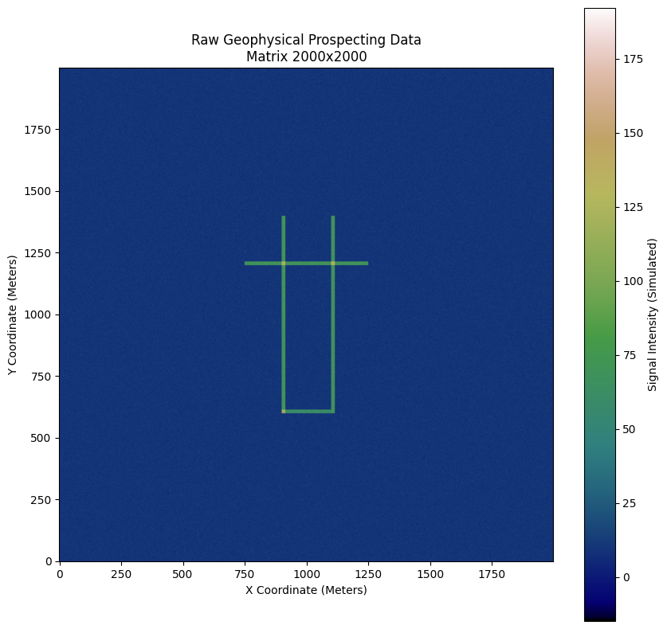
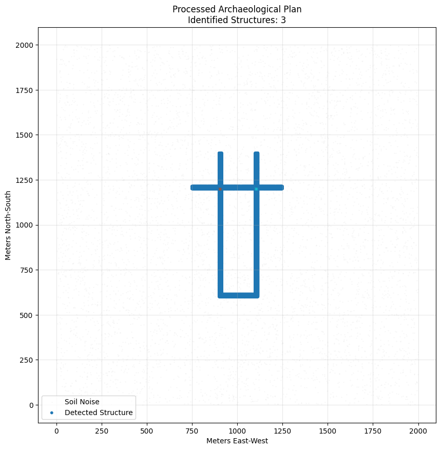
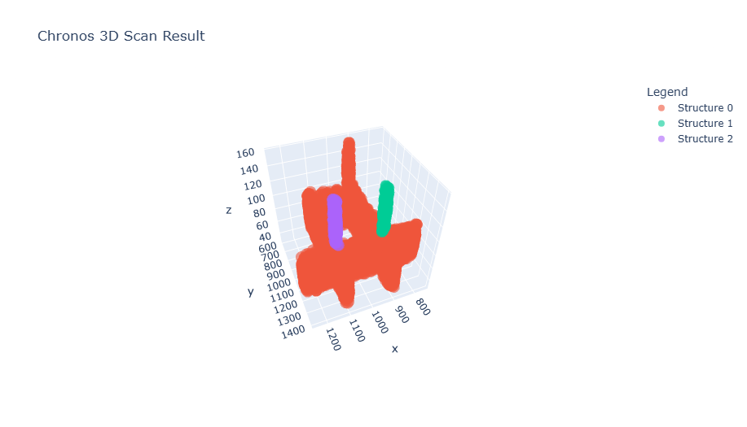
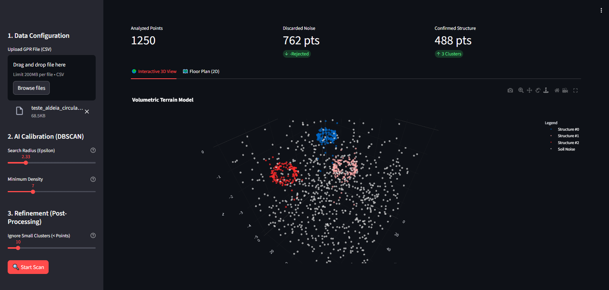

> 🇧🇷 **Para ler a versão em Português deste projeto, [clique aqui](README.pt-br.md).**

---

# 🏛️ Chronos: Archaeological AI Detection System


[](https://chronos-ai-archeology.streamlit.app/)

> **🔴 Live Demo:** Click the "Streamlit" badge above or [access the dashboard here](https://chronos-ai-archeology.streamlit.app/) to interact with the 2D and 3D model in real-time.

> **"Technology does not reinvent the past, but gives us new lenses to see it."**

## 📖 About the Project

**Chronos** is an Artificial Intelligence system focused on **Computational Archaeology**. The project utilizes Unsupervised Machine Learning algorithms (**DBSCAN**) to identify structural patterns (walls, foundations, necropolises) hidden within noisy geophysical data.

The goal is to simulate the processing of real field data — such as **GPR** (Ground Penetrating Radar) and **LIDAR** — automating the detection of archaeological sites and generating precise excavation reports.

---

## 🇻🇦 Motivation: The Vatican Challenge

One of the major inspirations for the development of *Chronos* was the archaeological complexity faced by institutions like the Vatican. **St. Peter's Basilica** sits upon millennia of stratified history, where physical excavations are risky or impossible.

The project seeks to answer: **How to map the sacred without touching it?**
* **Non-Invasive Archaeology:** Processing radar signals to see through marble.
* **Preservation:** Identification of voids and structures without the need for destructive excavation.

---

## 🛠️ Technologies and Inspirations

This repository serves as a study guide on technologies that are revolutionizing history (inspired by the channel [*Estranha História*](https://www.youtube.com/@henriquecaldeira), by Prof. Dr. Henrique Caldeira):

* **LIDAR (*Light Detection and Ranging*):** 3D terrain modeling via laser to virtually remove vegetation.
* **XRF (*X-Ray Fluorescence*):** Chemical analysis of materials via X-rays.
* **DBSCAN (Main Algorithm):** Spatial density-based clustering to separate "Signal" (Walls) from "Noise" (Loose stones).
* **Computational Geometry (Open3D):** Transitioning from vector points to 3D **Digital Twins** using Poisson Reconstruction and Convex Hulls (Cubature).

---

## 📂 Repository Structure

The project is divided into three progressive modules:

### 0. [Chronos Part 0: The Generator (Genesis)](Notebooks/en/Chronos_Archaeology_Exploration_Analysis.ipynb)
The project's foundation made for Data Analysis. Before analysis, we engineer a "Controlled Universe" to validate our hypotheses.
* **Stratigraphy Simulation:** Stochastic algorithm applying the *Law of Superposition* (Depth $\propto$ Age).
* **"Ground Truth" Injection:** Artificial creation of a "Royal Tomb" (Gold) concealed within noise to validate model efficacy.
* **AI Benchmarking:** Practical demonstration of **K-Means** limitations (geometric bias) vs. the necessity of **DBSCAN** (density-based) for archaeology.

### 1. [Chronos Part I: Vector Fundamentals](Notebooks/en/Chronos_Archaeology_Part_I.ipynb)
Focused on the introduction to computational geometry and linear pattern detection.
* **Scenarios:** Inca Wall (Sine wave), Circular Village, and Necropolis.
* **Technique:** Vector data ($X, Y, Z$).
* **Visualization:** Scatter plots and Folium Maps.
**📸 Part I Gallery:**
<p align="center">
  
  
  <br>
  <em>Fig 1: Detection of circular structures (Villages) and linear clusters (Necropolis).</em>
</p>

### 2. [Chronos Part II: Advanced Simulation (Raster)](Notebooks/en/Chronos_Archaeology_Part_II.ipynb)
Simulation of a real high-resolution geophysical survey (GPR).
* **Scenario:** A "Subterranean Basilica" hidden in a 4-million-point matrix.
* **Pipeline:**
    1.  **Raster Ingestion:** Image processing and signal histograms.
    2.  **Vectorization:** Heatmap to Vector conversion.
    3.  **`ChronosAnalyzer` Class:** Object-oriented architecture for processing.
    4.  **Business Intelligence:** Automatic generation of reports with areas ($m^2$) and excavation coordinates.
    
### 3. [Chronos Part III: Volumetric Reconstruction and Metrology](Notebooks/en/Chronos_Archaeology_Part_III.ipynb)
The leap to industrial-standard engineering. The pipeline goes beyond simply identifying anomalies and moves to reconstruct hermetic 3D solids from chaos.
* **Stress Test:** Simulation of a hostile prospecting environment with high *backscatter* (15,000 noise points) and a 30% sensor failure rate.
* **Geometric Engine (Open3D):** Processing of vector fields (Normals) and Poisson Surface Reconstruction with statistical density-based pruning.
* **Metrology and Auditing:** Volume and mass calculation (tons) for excavation sizing via *Convex Hull*.
    * Generation of Autonomous Metrological Reports (Bounding Box) and Algorithmic Confidence Heatmaps.

---

## 📊 Visual Results

> **Note:** GitHub renders static images below. To interact with the 3D plots (rotate/zoom), please open the notebooks in **Google Colab**.

The system transforms raw geophysical data into actionable engineering plans:

### 1. From Signal to Map (The Engineering Pipeline)
Comparison between the raw GPR input (raster) and the final vector blueprint generated by Chronos.

| Raw Data (Input) | Final Archeological Plan (Output) |
|:---:|:---:|
|  |  |
| *Noisy 2D Heatmap (Simulated GPR)* | *Clean Vector Map ready for excavation* |

### 2. The AI in Action (DBSCAN Processing)
How the algorithm visualizes data in 3D space to separate structural walls from geological noise.

| Phase I: Detection (Noisy) | Phase II: Refinement (Clean) |
|:---:|:---:|
|  |  |
| *DBSCAN identifying clusters amidst noise.* | *Final 3D Model after heuristic filtering.* |

### 3. Reverse Engineering (Digital Twins and Metrology)
Evolution of the raw point cloud to a solid mesh (*watertight mesh*) exportable to CAD, 3D Printers, and VR Engines, accompanied by a geometric uncertainty audit.

| Surface Reconstruction (Poisson) | Algorithmic Confidence Map |
|:---:|:---:|
|  |  |
| *Digital Twin generated from low SNR radar.* | *Yellow areas indicate high precision; purple indicates AI interpolation.* |

---

## 🎮 Interactive Web App (Deployment)

To connect the code to field operations, Chronos includes a production-ready dashboard built with **Streamlit**. This tool allows professionals (archaeologists, geologists, and engineers) to interact with the Artificial Intelligence algorithms without writing a single line of Python.

The evolution of the project's architecture has divided the interface into two main operational fronts:

### 📍 Macro-Prospecting (GPR and Raster)
Focused on analyzing vast extensions of terrain, mapping anomalies, and generating floor plans to guide excavation.


* **Real-Time Tuning:** Control of `Epsilon` and `Density` to calibrate the DBSCAN algorithm.
* **Heuristic Filter:** Dynamic cleaning of debris and geological noise.
* **Vector Export:** Download processed coordinates (`.csv`) for insertion into topography software.

### 🧊 Micro-Excavation and Digital Twins (V2 Update)
The major system update. Integrating the **Open3D** geometric engine, the application now supports heavy three-dimensional topology processing directly via the browser.


* **Industrial Ingestion (LIDAR):** Native *drag-and-drop* support for massive laser scan files (`.las`, `.laz`) or structured synthetic data.
* **Memory Optimization:** Executes automatic *Voxel Downsampling* to compress spatial *Big Data* and protect server RAM.
* **Real-Time Reconstruction:** Applies Statistical Outlier Removal (SOR) filters and **Poisson Surface Reconstruction** to transform radar dust into solid surfaces.
* **Digital Curation:** Allows immediate download of the rescued structure in the universal `.obj` format, ready for 3D printing, Blender, or Virtual Reality (VR) Engines.

---

### 🚀 How to Run the App (Local Environment)

> ⚠️ **Compatibility Warning:** The geometric engine `Open3D` (used in 3D rendering) requires **Python 3.11** or lower, currently lacking native support for version 3.13. To avoid conflicts, it is strictly recommended to run the application isolated in a virtual environment.

> Follow the step-by-step below to start the dashboard on your machine. 

> *The instructions are also in the app.py file*

**0. Install Streamlit:**
```bash
pip install streamlit
```

**1. Create and Activate a Virtual Environment (Python 3.11)**

*For Windows users:*
```bash
py -3.11 -m venv .venv311
.\.venv311\Scripts\activate
```
*For Linux/Mac users:*
```bash
py -3.11 -m venv .venv311
source .venv311/bin/activate
```
**2. Install Project Dependencies**

With the isolated environment active (you will see `(.venv311)` in your terminal), install the necessary libraries:
```bash
pip install -r requirements.txt
```

**3. Run the Dashboard**
```bash
streamlit run app/app_pt.py
```

**4. End the Session**

After closing the browser and stopping the server in the terminal (`Ctrl + C`), deactivate the virtual environment to return to your system's global Python:
```bash
deactivate
```

---

## 🚀 How to Run

This project was developed to run on **Google Colab** or **Jupyter Notebook**.

### Prerequisites
#### Core and Visual Dependencies
```bash
pip install pandas numpy scikit-learn plotly folium matplotlib
```
#### Geometry and LIDAR Ingestion Dependencies
```bash
pip install open3d scipy alphashape laspy[lazrs] streamlit
```

#### Or you can install all dependencies manually via the `requirements.txt` file:
```bash
pip install -r requirements.txt
```

---

## 👨‍💻 Author

**Isaac Davi** *Developer*

Built as a portfolio project exploring the intersection of **History** and **Technology**.  
Feel free to reach out for collaborations or questions.

---

## 📄 License

This project is intended for **academic and educational purposes**.

* **Free to use:** You may modify and distribute this code for learning and research.
* **Synthetic Data:** Please note that the archaeological data generated in this pipeline is **simulated** (procedural generation) and does not represent real protected sites.

---
