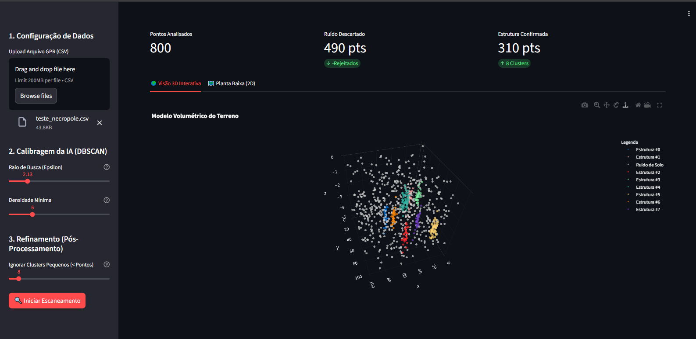

> 🇺🇸 **To read the English version of this project, [click here](README.md).**

---

# 🏛️ Chronos: Sistema de Detecção Arqueológica via IA


[](https://chronos-ai-archeology.streamlit.app/)

> **🔴 Demo Online:** Clique no selo "Streamlit" acima ou [acesse o dashboard aqui](https://chronos-ai-archeology.streamlit.app/) para interagir com o modelo 2D e 3D em tempo real.

> **"A tecnologia não reinventa o passado, mas nos dá novas lentes para enxergá-lo."**

## 📖 Sobre o Projeto

O **Chronos** é um sistema de Inteligência Artificial focado em **Arqueologia Computacional**. O projeto utiliza algoritmos de Machine Learning Não Supervisionado (**DBSCAN**) para identificar padrões estruturais (muralhas, fundações, necrópoles) ocultos em dados geofísicos ruidosos.

O objetivo é simular o processamento de dados reais de campo — como **GPR** (Radar de Penetração no Solo) e **LIDAR** — automatizando a detecção de sítios arqueológicos e gerando relatórios de escavação precisos.

---

## 🇻🇦 Motivação: O Desafio do Vaticano

Uma das grandes inspirações para o desenvolvimento do *Chronos* foi a complexidade arqueológica enfrentada por instituições como o Vaticano. A **Basílica de São Pedro** assenta-se sobre milênios de história estratificada, onde escavações físicas são arriscadas ou impossíveis.

O projeto busca responder: **Como mapear o sagrado sem tocá-lo?**
* **Arqueologia Não-Invasiva:** Processamento de sinais de radar para ver através do mármore.
* **Preservação:** Identificação de vazios e estruturas sem a necessidade de escavação destrutiva.

---

## 🛠️ Tecnologias e Inspirações

Este repositório serve como guia de estudos sobre tecnologias que estão revolucionando a história (inspirado pelo canal *Estranha História*, do Prof. Dr. Henrique Caldeira):

* **LIDAR (*Light Detection and Ranging*):** Modelagem 3D de terreno via laser para remover vegetação virtualmente.
* **XRF (*X-Ray Fluorescence*):** Análise química de materiais via raios-x.
* **DBSCAN (Algoritmo Principal):** Clusterização baseada em densidade espacial para separar "Sinal" (Muros) de "Ruído" (Pedras soltas).

---

## 📂 Estrutura do Repositório

O projeto está dividido em dois módulos progressivos:

### 0. [Chronos Parte 0: O Gerador (Genesis)](Chronos_Arqueologia_Analise_Exploratoria.ipynb)
A fundação do projeto que foi feita para a Análise de Dados. Antes de analisar, criamos um "Universo Controlado" para validar nossas hipóteses.
* **Simulação de Estratigrafia:** Algoritmo estocástico que aplica a *Lei da Superposição* (Profundidade $\propto$ Idade).
* **Injeção de "Ground Truth":** Criação artificial de uma "Tumba Real" (Ouro) oculta no ruído para testar a eficácia dos modelos.
* **Comparativo de IA:** Demonstração prática das limitações do **K-Means** (geométrico) versus a necessidade do **DBSCAN** (densidade) para arqueologia.

### 1. [Chronos Parte I: Fundamentos Vetoriais](Chronos_Aqueologia_Parte_I.ipynb)
Focado na introdução à geometria computacional e detecção de padrões lineares.
* **Cenários:** Muralha Inca (Senoide) e Aldeia Circular.
* **Técnica:** Dados vetoriais ($X, Y, Z$).
* **Visualização:** Gráficos de dispersão e Mapas Folium.
**📸 Galeria da Parte I:**
<p align="center">
  
  
  <br>
  <em>Fig 1: Detecção de estruturas circulares (Vilas) e clusters lineares (Necrópole).</em>
</p>

### 2. [Chronos Parte II: Simulação Avançada (Raster)](Chronos_Arqueologia_Parte_II.ipynb)
Simulação de uma prospecção geofísica real (GPR) em alta resolução.
* **Cenário:** Uma "Basílica Subterrânea" oculta em uma matriz de 4 milhões de pontos.
* **Pipeline:**
    1.  **Ingestão Raster:** Tratamento de imagem e histogramas de sinal.
    2.  **Vetorização:** Conversão de Heatmap para Vetores.
    3.  **Classe `ChronosAnalyzer`:** Arquitetura orientada a objetos para processamento.
    4.  **Business Intelligence:** Geração automática de relatórios com áreas ($m^2$) e coordenadas de escavação.

---

## 📊 Resultados Visuais

> **Nota:** O GitHub exibe apenas imagens estáticas abaixo. Para interagir com os gráficos 3D (rotacionar/zoom), por favor abra os notebooks no **Google Colab**.

O sistema transforma dados geofísicos brutos em plantas de engenharia acionáveis:

### 1. Do Sinal ao Mapa (O Pipeline de Engenharia)
Comparação entre a entrada bruta de GPR (raster) e a planta vetorial final gerada pelo Chronos.

| Dados Brutos (Entrada) | Planta Arqueológica Final (Saída) |
|:---:|:---:|
|  |  |
| *Mapa de Calor 2D Ruidoso (GPR Simulado)* | *Mapa Vetorial Limpo pronto para escavação* |

### 2. A IA em Ação (Processamento DBSCAN)
Como o algoritmo visualiza os dados no espaço 3D para separar paredes estruturais de ruído geológico.

| Fase I: Detecção (Ruidoso) | Fase II: Refinamento (Limpo) |
|:---:|:---:|
|  |  |
| *DBSCAN identificando clusters em meio ao ruído.* | *Modelo 3D Final após filtragem heurística.* |

---

## 🎮 Web App Interativo (Deploy)

Para conectar o código à operação de campo, o Chronos inclui um dashboard pronto para produção construído com **Streamlit**. Esta ferramenta permite que arqueólogos interajam com o algoritmo sem precisar escrever uma única linha de Python.



### Funcionalidades:
* **Ajuste em Tempo Real:** Mova os sliders de `Epsilon` e `Densidade` para ver mudanças imediatas no modelo 3D.
* **Filtro Heurístico:** Controle o limiar de pós-processamento para limpar detritos dinamicamente.
* **Exportação:** Baixe os dados vetoriais processados (`.csv`) diretamente pelo navegador.

### 🚀 Como Rodar o App
Para iniciar o dashboard localmente:

1.  Instale o Streamlit:
    ```bash
    pip install streamlit
    ```
2.  Execute a aplicação (Escolha o idioma):
    ```bash
    # Para Versão em Português
    streamlit run app/app_pt.py

    # For English Version
    streamlit run app/app_en.py
    ```

---

## 🚀 Como Executar

Este projeto foi desenvolvido para rodar no **Google Colab** ou **Jupyter Notebook**.

### Pré-requisitos
```bash
pip install pandas numpy scikit-learn plotly folium matplotlib
```

---

## 👨‍💻 Autor

**Isaac Davi** *Desenvolvedor*

Construído como um projeto de portfólio explorando a interseção entre **História** e **Tecnologia**.  
Sinta-se à vontade para entrar em contato para colaborações ou dúvidas.

---

## 📄 Licença

Este projeto é de uso **acadêmico e educacional**.

* **Livre uso:** Você pode modificar e distribuir este código para fins de aprendizado e pesquisa.
* **Dados Sintéticos:** Observe que os dados arqueológicos gerados neste pipeline são **simulados** (geração procedural) e não representam sítios reais protegidos.

---
