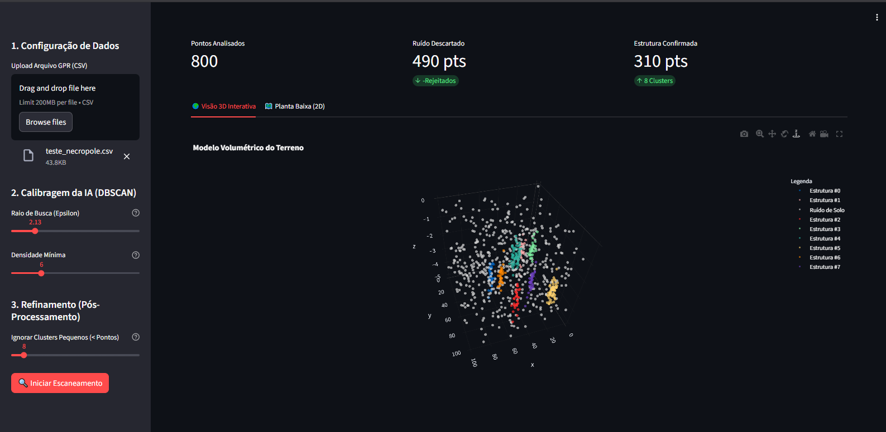

> 🇺🇸 **To read the English version of this project, [click here](README.md).**

---

# 🏛️ Chronos: Sistema de Detecção Arqueológica por IA


[](https://chronos-ai-archeology.streamlit.app/)

> **🔴 Demo ao vivo:** clique no selo "Streamlit" acima ou [acesse o dashboard aqui](https://chronos-ai-archeology.streamlit.app/) para interagir com o modelo 2D e 3D em tempo real.

> **"A tecnologia não reinventa o passado, mas nos dá novas lentes para vê-lo."**

## 📖 Sobre o Projeto

**Chronos** é um sistema de Inteligência Artificial voltado à **Arqueologia Computacional**. O projeto usa aprendizado de máquina não supervisionado (**DBSCAN**) para identificar padrões estruturais — muros, fundações, necrópoles — escondidos dentro de dados geofísicos ruidosos.

O objetivo é simular o processamento de dados reais de campo, como **GPR** (radar de penetração no solo) e **LIDAR**, automatizando a detecção de feições arqueológicas e gerando relatórios de escavação.

> ⚠️ **Todos os dados deste repositório são sintéticos.** Cada resultado abaixo é medido contra um ground truth que o simulador gerou por construção. Isso torna as métricas confiáveis como medida do *comportamento do algoritmo*, e **não** como medida de desempenho em campo. A validação em dado real de levantamento é o próximo marco (v3.0), e a distinção é mantida explícita até lá.

---

## 🇻🇦 Motivação: O Desafio do Vaticano

Uma das inspirações do *Chronos* foi a complexidade arqueológica enfrentada por instituições como o Vaticano. A **Basílica de São Pedro** repousa sobre milênios de história estratificada, onde escavações físicas são arriscadas ou impossíveis.

O projeto pergunta: **como mapear o sagrado sem tocá-lo?**

* **Arqueologia não-invasiva:** processar sinais de radar para enxergar através do mármore.
* **Preservação:** identificar vazios e estruturas sem escavação destrutiva.

> 📌 **Uma precisão necessária:** a necrópole sob São Pedro — os [*Scavi*][https://visite.basilicasanpietro.va/en/booking/necropolivaticana] — foi escavada entre 1940 e 1949 e é extensamente publicada. É um **precedente**, não uma fronteira inexplorada. O *monitoramento* não-invasivo de um sítio conhecido e frágil é um caso de uso real: sítios escavados precisam ser monitorados contra subsidência e degradação estrutural.

---

## 🛠️ Tecnologias e Inspirações

Este repositório serve também como guia de estudo sobre tecnologias que estão mudando como lemos a história (inspirado pelo canal [*Estranha História*](https://www.youtube.com/@henriquecaldeira), do Prof. Dr. Henrique Caldeira):

* **LIDAR (*Light Detection and Ranging*):** modelagem 3D do terreno via laser, para remover a vegetação virtualmente.
* **XRF (*Fluorescência de Raios-X*):** análise química de materiais via raios-X. Note que o **GPR não faz isso** — ele mede contraste dielétrico, não composição. Qualquer atribuição de material neste pipeline é uma hipótese que aguarda XRF ou análise direta.
* **DBSCAN:** agrupamento espacial por densidade, separando sinal (muros) de ruído (pedras soltas).
* **Geometria computacional (Open3D):** de pontos vetoriais a gêmeos digitais 3D via reconstrução de Poisson e fechos convexos.

---

## 📂 Estrutura do Repositório

```
Chronos-AI/
├── notebooks/
│   ├── en/          Chronos_Archaeology_{Exploration_Analysis, Part_I, Part_II, Part_III}.ipynb
│   └── pt-br/       Chronos_Arqueologia_{Analise_Exploratoria, Parte_I, Parte_II, Parte_III}.ipynb
├── app/             app_pt.py, app_en.py, chronos_core.py
├── data/            conjuntos sintéticos (.csv, .las)
├── assets/          imagens e gráficos
├── docs/            LICENSE-COMMERCIAL.pt-br.md
├── requirements.txt / requirements-dev.txt
└── README.md / README.pt-br.md / LICENSE
```

### 0. [Parte 0: O Gerador (Gênese)](notebooks/pt-br/Chronos_Arqueologia_Analise_Exploratoria.ipynb)
A base. Antes de qualquer análise, construímos um universo controlado contra o qual validar hipóteses.
* **Simulação de estratigrafia:** algoritmo estocástico aplicando a *Lei da Superposição* (profundidade ∝ idade).
* **Injeção de ground truth:** uma "Tumba Real" escondida no ruído, para que a eficácia do modelo possa ser *medida* em vez de afirmada.
* **Benchmark de IA:** demonstração das limitações do **K-Means** (viés geométrico) contra a necessidade do **DBSCAN** (por densidade).

### 1. [Parte I: Fundamentos Vetoriais](notebooks/pt-br/Chronos_Aqueologia_Parte_I.ipynb)
Geometria computacional e detecção de padrões lineares.
* **Cenários:** muralha inca (senoide), aldeia circular, necrópole.
* **Técnica:** dados vetoriais (X, Y, Z), os três eixos em metros.
* **Visualização:** dispersão e mapas Folium, com georreferenciamento corrigido por latitude.

**📸 Galeria da Parte I:**
<p align="center">
  
  
  <br>
  <em>Fig 1: Detecção de estruturas circulares (aldeias) e clusters lineares (necrópole).</em>
</p>

### 2. [Parte II: Simulação Avançada (Raster)](notebooks/pt-br/Chronos_Arqueologia_Parte_II.ipynb)
Simulação de um levantamento geofísico de alta resolução.
* **Cenário:** uma basílica subterrânea escondida numa matriz de 2000 × 2000 pixels — **500 m × 500 m de terreno** na escala declarada de 0,25 m/pixel.
* **Pipeline:**
    1. **Ingestão raster:** processamento de imagem e histogramas de sinal.
    2. **Limiarização:** Otsu e μ+3σ, pontuados contra a máscara de verdade.
    3. **Vetorização:** conversão de mapa de calor para vetor.
    4. **`ChronosAnalyzer`:** agrupamento *apenas no espaço* — a intensidade do radar é usada como peso, nunca como coordenada.
    5. **Relatório:** áreas em m², footprint real ao lado da bounding box, e coordenadas de escavação.

### 3. [Parte III: Reconstrução Volumétrica e Metrologia](notebooks/pt-br/Chronos_Arqueologia_Parte_III.ipynb)
O salto para engenharia volumétrica.
* **Stress test:** ambiente hostil de prospecção com **25.000 pontos de ruído** e 30% de taxa de falha do sensor.
* **Motor geométrico (Open3D):** estimativa de normais com raio derivado da nuvem, orientação para fora verificada contra o centroide, e reconstrução de superfície de Poisson com poda estatística por densidade.
* **Metrologia e auditoria:** quatro grandezas distintas reportadas separadamente — envelope AABB, fecho convexo, e volume real *quando a malha é fechada* — mais uma tabela de cenários de massa e um mapa de confiança algorítmica.

---

## 🔄 Novidades da v2.1

A v2.1 é uma versão de rigor. O pipeline agora **mede** a própria saída em cada
etapa em vez de descrevê-la, e a escala física de cada resultado é declarada e
carregada até o relatório.

**Avaliação em toda parte.** O simulador gera ground truth por construção —
sabemos quais pixels são parede e quais pontos são sinal. Cada etapa agora se
pontua contra isso: precisão, recall, IoU, especificidade.

**Unidades declaradas.** Uma malha de levantamento é medida em pixels; metros é o
que se obtém depois de multiplicar por uma escala declarada. O `PIXEL_SIZE_M`
agora é explícito e propagado até o relatório de escavação.

**Estatística no lugar do olhômetro.** O limiar de detecção é escolhido por Otsu
ou μ+3σ e pontuado, não fixado à mão. O raio do DBSCAN pode ser sugerido pelo
joelho da k-distância. O georreferenciamento é corrigido por latitude.

**Afirmações verificadas.** A topologia da malha é checada com `is_watertight()`
antes de qualquer coisa ser dita sobre ela. A volumetria reporta quatro grandezas
distintas — envelope AABB, caixa orientada, fecho convexo e volume real — em vez
de colapsá-las num número só. A massa é uma tabela de cenários com seis
materiais, com os limites do instrumento declarados: o GPR mede contraste
dielétrico, não composição.

**Uma etapa de detecção antes da reconstrução.** O SOR é um filtro de
uniformidade de densidade, não um detector, então o DBSCAN agora roda entre o
filtro e o Poisson.

---

## 📊 Resultados Visuais

> **Nota:** o GitHub renderiza as imagens estáticas abaixo. Para interagir com os gráficos 3D, abra os notebooks no **Google Colab** — o renderer agora é detectado em tempo de execução, então eles vão de fato aparecer.

### 1. Do Sinal ao Mapa

| Dado Bruto (Entrada) | Planta Arqueológica Final (Saída) |
|:---:|:---:|
|  |  |
| *Mapa de calor 2D ruidoso (GPR simulado)* | *Mapa vetorial limpo, pronto para escavação* |

### 2. A IA em Ação (Processamento DBSCAN)

| Fase I: Detecção (Ruidosa) | Fase II: Refinamento (Limpa) |
|:---:|:---:|
|  |  |
| *DBSCAN identificando clusters em meio ao ruído.* | *Modelo 3D final após filtragem heurística.* |

### 3. Engenharia Reversa (Gêmeos Digitais e Metrologia)

| Reconstrução de Superfície (Poisson) | Mapa de Confiança Algorítmica |
|:---:|:---:|
|  |  |
| *Malha de superfície a partir de radar com baixa SNR.* | *Amarelo indica forte suporte de dado; roxo indica interpolação de Poisson.* |

> ⚠️ **Estas figuras são anteriores ao pipeline atual e serão regeradas no futuro.** Foram produzidas antes de a etapa de detecção ser acrescentada, então a malha está mais próxima do envelope de Poisson da nuvem de pontos do que do artefato em si. Também, o **mapa de confiança mede suporte de reconstrução, não certeza de detecção** — para confiança de detecção, estabilidade por bootstrap é a ferramenta certa que usaremos para tal.

---

## 🎮 Aplicação Web Interativa

O Chronos inclui um dashboard em **Streamlit**, para que arqueólogos, geólogos e engenheiros usem os algoritmos sem escrever Python.

### 📍 Macro-prospecção (GPR e Raster)


* **Ajuste em tempo real:** controle de `Epsilon` e `Densidade` para o DBSCAN, com sugestão pelo joelho da k-distância.
* **Filtro heurístico:** limpeza dinâmica de detritos e ruído geológico.
* **Exportação vetorial:** download das coordenadas processadas (`.csv`) para software de topografia.

### 🧊 Micro-escavação e Gêmeos Digitais


* **Ingestão industrial (LIDAR):** *drag-and-drop* de `.las` / `.laz`, com as coordenadas centralizadas na carga para que valores UTM não degradem o octree do Poisson.
* **Downsampling adaptativo:** tamanho de voxel derivado da extensão da cena em vez de fixo no código.
* **Reconstrução:** SOR → detecção DBSCAN → Poisson, com a topologia verificada antes de qualquer afirmação ser impressa.
* **Exportação:** `.ply` (preserva cor de vértice, então o mapa de confiança sobrevive) e `.obj` (CAD, impressão 3D, VR).

---

## 🚀 Como Executar

### ⚠️ Versão do Python — leia isto primeiro

**O Open3D 0.19 publica wheels apenas para cp38–cp312. Não existe wheel cp313.** No Python 3.13 os módulos 3D simplesmente não instalam, e a Parte III falha com `ModuleNotFoundError: No module named 'open3d'`.

**Use Python 3.10, 3.11 ou 3.12.**

```bash
# Linux / macOS
python3.12 -m venv .venv
source .venv/bin/activate

# Windows
py -3.12 -m venv .venv
.\.venv\Scripts\activate

pip install -r requirements.txt
```

Depois aponte o Jupyter para esse ambiente:

```bash
pip install ipykernel
python -m ipykernel install --user --name chronos --display-name "Python 3.12 (Chronos)"
```

…e selecione **Python 3.12 (Chronos)** como kernel. Rodar os notebooks contra um kernel 3.13 do sistema é, de longe, a origem mais comum de erros.

### Rodando o dashboard

```bash
streamlit run App/app_pt.py     # ou App/app_en.py
```

---

## 🗺️ Roadmap (v3.0)

1. **Visualização de relevo sobre LiDAR real** — Sky-View Factor (Zakšek et al. 2011), Local Relief Model (Hesse 2010), Openness (Doneus 2013), via o toolbox RVT. E LiDAR nacional aberto (AHN, Environment Agency do Reino Unido) torna isso imediatamente testável.
2. **GPR fisicamente realista** — gprMax (Warren et al. 2016) para modelagem direta por FDTD, mais a cadeia de processamento padrão, da qual a **migração** é a etapa que colapsa hipérboles em pontos.
3. **Deep learning, com enquadramento honesto** — U-Net sobre rasters de MDT, seguindo Verschoof-van der Vaart & Lambers (2019). 2D, com dado aberto rotulado — não PointNet sobre ânforas sintéticas.

---

## O que o Chronos **não** faz

Nossos limites:

- **Não identifica materiais.** GPR mede contraste dielétrico. Qualquer atribuição de material (cerâmica, bronze, pedra) é hipótese do operador e exige XRF, XRD ou análise direta para confirmar. A tabela de cenários de massa existe para tornar isso explícito.
- **Não data nada.** Não há relação entre a resposta geofísica e a cronologia.
- **Não substitui prospecção física.** Toda anomalia é uma hipótese até que uma sondagem a confirme ou refute.
- **Não é validado em campo.** Até a v3.0, todos os resultados são sobre dado sintético, onde o ground truth é conhecido por construção. Isso torna as métricas confiáveis como medida de *comportamento do algoritmo*, e não como medida de desempenho em campo. Essa validação depende de dado real — está no roadmap, e a distinção deve ser mantida explícita até lá.

Gostaria de destacar que esse é um projeto totalmente acadêmico, e que o uso de dados arqueológicos reais requer **autorização legal**.

Além disso, o projeto visa o desenvolvimento pessoal, aprendizado e exploração ferramentas técnicas de arqueologia computacional com IA.

---

## 👨‍💻 Autor

**Isaac Davi** — *Desenvolvedor*

Construído como projeto de portfólio explorando a interseção entre **história** e **tecnologia**. Fique à vontade para entrar em contato para colaborações ou dúvidas.

---

## 📚 Referências

### Algoritmos neste projeto

* Ester, M., Kriegel, H.-P., Sander, J. & Xu, X. (1996). A Density-Based Algorithm for Discovering Clusters in Large Spatial Databases with Noise. *Anais do KDD-96*, 226–231. — DBSCAN.
* Campello, R. J. G. B., Moulavi, D. & Sander, J. (2013). Density-Based Clustering Based on Hierarchical Density Estimates. *PAKDD 2013*, LNCS 7819, 160–172. — HDBSCAN.
* Kazhdan, M., Bolitho, M. & Hoppe, H. (2006). Poisson Surface Reconstruction. *Symposium on Geometry Processing*, 61–70.
* Kazhdan, M. & Hoppe, H. (2013). Screened Poisson Surface Reconstruction. *ACM Transactions on Graphics* 32(3), 1–13. — a variante que o Open3D implementa.
* Bernardini, F. et al. (1999). The Ball-Pivoting Algorithm for Surface Reconstruction. *IEEE Transactions on Visualization and Computer Graphics* 5(4), 349–359.
* Otsu, N. (1979). A Threshold Selection Method from Gray-Level Histograms. *IEEE Transactions on Systems, Man, and Cybernetics* 9(1), 62–66.
* Satopää, V., Albrecht, J., Irwin, D. & Raghavan, B. (2011). Finding a "Kneedle" in a Haystack: Detecting Knee Points in System Behavior. *ICDCS Workshops*, 166–171. — joelho da k-distância.
* Fischler, M. A. & Bolles, R. C. (1981). Random Sample Consensus. *Communications of the ACM* 24(6), 381–395. — RANSAC.
* Matthews, B. W. (1975). Comparison of the predicted and observed secondary structure of T4 phage lysozyme. *Biochimica et Biophysica Acta* 405(2), 442–451. — coeficiente MCC.
* Hubert, L. & Arabie, P. (1985). Comparing partitions. *Journal of Classification* 2, 193–218. — Índice Rand Ajustado.

### Software

* Zhou, Q.-Y., Park, J. & Koltun, V. (2018). Open3D: A Modern Library for 3D Data Processing. *arXiv:1801.09847*.
* Pedregosa, F. et al. (2011). Scikit-learn: Machine Learning in Python. *JMLR* 12, 2825–2830.
* Harris, C. R. et al. (2020). Array programming with NumPy. *Nature* 585, 357–362.
* Virtanen, P. et al. (2020). SciPy 1.0: fundamental algorithms for scientific computing in Python. *Nature Methods* 17, 261–272.
* McKinney, W. (2010). Data Structures for Statistical Computing in Python. *Anais da 9ª Python in Science Conference*, 56–61. — pandas.
* Hunter, J. D. (2007). Matplotlib: A 2D Graphics Environment. *Computing in Science & Engineering* 9(3), 90–95.
* van der Walt, S. et al. (2014). scikit-image: image processing in Python. *PeerJ* 2:e453.

### Arqueologia e geofísica

* Conyers, L. B. (2023). *Ground-Penetrating Radar for Archaeology*, 4ª ed. Lanham: Rowman & Littlefield.
* Jol, H. M. (org.) (2009). *Ground Penetrating Radar: Theory and Applications*. Amsterdã: Elsevier.
* Gaffney, C. & Gater, J. (2003). *Revealing the Buried Past: Geophysics for Archaeologists*. Stroud: Tempus.
* Schmidt, A. et al. (2015). *EAC Guidelines for the Use of Geophysics in Archaeology: Questions to Ask and Points to Consider*. EAC Guidelines 2. Namur: Europae Archaeologiae Consilium.
* Conolly, J. & Lake, M. (2006). *Geographical Information Systems in Archaeology*. Cambridge: Cambridge University Press.
* Renfrew, C. & Bahn, P. (2016). *Archaeology: Theories, Methods and Practice*, 7ª ed. Londres: Thames & Hudson.
* Bevan, A. & Lake, M. (orgs.) (2013). *Computational Approaches to Archaeological Spaces*. Walnut Creek: Left Coast Press.
* de Berg, M., Cheong, O., van Kreveld, M. & Overmars, M. (2008). *Computational Geometry: Algorithms and Applications*, 3ª ed. Berlim: Springer.

---

## 📄 Licença

**Código** — [GNU Affero General Public License v3.0](LICENSE) (AGPL-3.0)

Você pode usar, estudar, modificar e redistribuir este código. Em troca, a AGPL pede reciprocidade: se você distribuir uma versão modificada (§5), ou permitir que usuários interajam com uma versão modificada remotamente por meio de uma rede (§13), precisa disponibilizar a eles o código-fonte correspondente sob a mesma licença.

**Documentação, narrativa, figuras e dados sintéticos** —
[CC BY-NC-SA 4.0](https://creativecommons.org/licenses/by-nc-sa/4.0/)

**Licenciamento comercial** — Há uma licença separada para organizações que
precisem evitar as obrigações de reciprocidade da AGPL, por exemplo para embutir
o Chronos AI em um produto proprietário ou serviço hospedado. Veja [LICENSE-COMMERCIAL.pt-br.md](docs/LICENSE-COMMERCIAL.pt-br.md). Aquele documento é informativo e não concede nada por si só; qualquer licença comercial exige acordo assinado.

Universidades, museus e instituições de patrimônio sem fins lucrativos podem usar o software sob a AGPL-3.0 sem licença comercial. Elas continuam sujeitas à AGPL se distribuírem modificações ou operarem um serviço de rede baseado nelas.

**Escopo** — Apenas o material de titularidade do detentor dos direitos é
licenciado aqui. Dependências de terceiros não são redistribuídas e permanecem sob suas próprias condições.

**Versões anteriores** — Releases publicados sob a Licença MIT continuam
disponíveis sob a Licença MIT. Mudança de licença não é retroativa.

**Dados sintéticos** — Todos os dados arqueológicos deste repositório são gerados proceduralmente e não representam sítios reais protegidos.

Copyright © 2026 Isaac Davi.