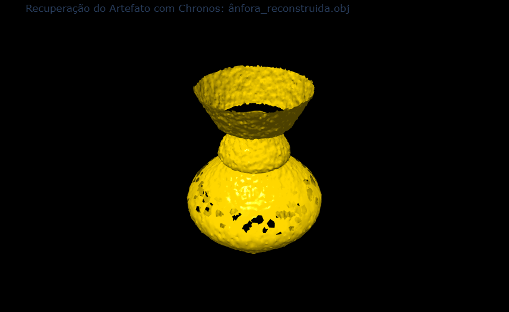
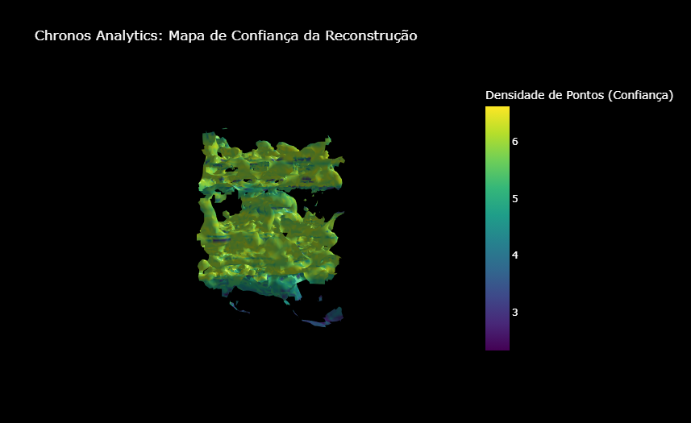
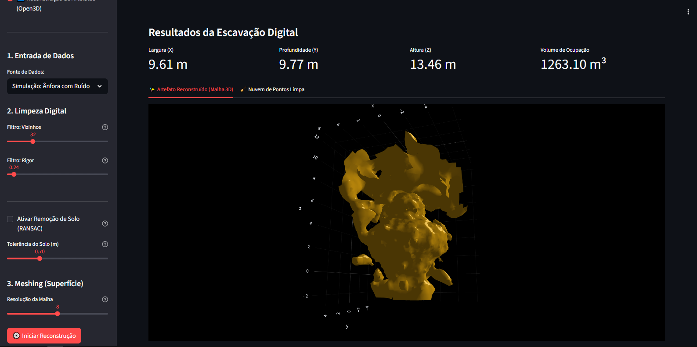

> 🇺🇸 **To read the English version of this project, [click here](README.md).**

---

# 🏛️ Chronos: Sistema de Detecção Arqueológica via IA


[](https://chronos-ai-archeology.streamlit.app/)

> **🔴 Demo Online:** Clique no selo "Streamlit" acima ou [acesse o dashboard aqui](https://chronos-ai-archeology.streamlit.app/) para interagir com o modelo 2D e 3D em tempo real.

> **"A tecnologia não reinventa o passado, mas nos dá novas lentes para enxergá-lo."**

## 📖 Sobre o Projeto

O **Chronos** é um sistema de Inteligência Artificial focado em **Arqueologia Computacional**. O projeto utiliza algoritmos de Machine Learning Não Supervisionado (**DBSCAN**) para identificar padrões estruturais (muralhas, fundações, necrópoles) ocultos em dados geofísicos ruidosos.

O objetivo é simular o processamento de dados reais de campo — como **GPR** (Radar de Penetração no Solo) e **LIDAR** — automatizando a detecção de sítios arqueológicos e gerando relatórios de escavação precisos.

---

## 🇻🇦 Motivação: O Desafio do Vaticano

Uma das grandes inspirações para o desenvolvimento do *Chronos* foi a complexidade arqueológica enfrentada por instituições como o Vaticano. A **Basílica de São Pedro** assenta-se sobre milênios de história estratificada, onde escavações físicas são arriscadas ou impossíveis.

O projeto busca responder: **Como mapear o sagrado sem tocá-lo?**
* **Arqueologia Não-Invasiva:** Processamento de sinais de radar para ver através do mármore.
* **Preservação:** Identificação de vazios e estruturas sem a necessidade de escavação destrutiva.

---

## 🛠️ Tecnologias e Inspirações

Este repositório serve como guia de estudos sobre tecnologias que estão revolucionando a história (inspirado pelo canal *Estranha História*, do Prof. Dr. Henrique Caldeira):

* **LIDAR (*Light Detection and Ranging*):** Modelagem 3D de terreno via laser para remover vegetação virtualmente.
* **XRF (*X-Ray Fluorescence*):** Análise química de materiais via raios-x.
* **DBSCAN (Algoritmo Principal):** Clusterização baseada em densidade espacial para separar "Sinal" (Muros) de "Ruído" (Pedras soltas).
* **Geometria Computacional (Open3D):** Transição de pontos vetoriais para **Gêmeos Digitais** tridimensionais utilizando Reconstrução de Poisson e Fechos Convexos (Cubagem).

---

## 📂 Estrutura do Repositório

O projeto está dividido em três módulos progressivos:

### 0. [Chronos Parte 0: O Gerador (Genesis)](Notebooks/pt-br/Chronos_Arqueologia_Analise_Exploratoria.ipynb)
A fundação do projeto que foi feita para a Análise de Dados. Antes de analisar, criamos um "Universo Controlado" para validar nossas hipóteses.
* **Simulação de Estratigrafia:** Algoritmo estocástico que aplica a *Lei da Superposição* (Profundidade $\propto$ Idade).
* **Injeção de "Ground Truth":** Criação artificial de uma "Tumba Real" (Ouro) oculta no ruído para testar a eficácia dos modelos.
* **Comparativo de IA:** Demonstração prática das limitações do **K-Means** (geométrico) versus a necessidade do **DBSCAN** (densidade) para arqueologia.

### 1. [Chronos Parte I: Fundamentos Vetoriais](Notebooks/pt-br/Chronos_Aqueologia_Parte_I.ipynb)
Focado na introdução à geometria computacional e detecção de padrões lineares.
* **Cenários:** Muralha Inca (Senoide) e Aldeia Circular.
* **Técnica:** Dados vetoriais ($X, Y, Z$).
* **Visualização:** Gráficos de dispersão e Mapas Folium.
**📸 Galeria da Parte I:**
<p align="center">
  
  
  <br>
  <em>Fig 1: Detecção de estruturas circulares (Vilas) e clusters lineares (Necrópole).</em>
</p>

### 2. [Chronos Parte II: Simulação Avançada (Raster)](Notebooks/pt-br/Chronos_Arqueologia_Parte_II.ipynb)
Simulação de uma prospecção geofísica real (GPR) em alta resolução.
* **Cenário:** Uma "Basílica Subterrânea" oculta em uma matriz de 4 milhões de pontos.
* **Pipeline:**
    1.  **Ingestão Raster:** Tratamento de imagem e histogramas de sinal.
    2.  **Vetorização:** Conversão de Heatmap para Vetores.
    3.  **Classe `ChronosAnalyzer`:** Arquitetura orientada a objetos para processamento.
    4.  **Business Intelligence:** Geração automática de relatórios com áreas ($m^2$) e coordenadas de escavação.

### 3. [Chronos Parte III: Reconstrução Volumétrica e Metrologia](Notebooks/pt-br/Chronos_Arqueologia_Parte_III.ipynb)
O salto para a engenharia de padrão industrial. O pipeline deixa de apenas identificar anomalias e passa a reconstruir sólidos 3D herméticos a partir do caos.
* **Teste de Estresse (Stress Test):** Simulação de um ambiente de prospecção hostil com alto *backscatter* (15.000 pontos de ruído) e 30% de falha de sensor.
* **Motor Geométrico (Open3D):** Processamento de campos vetoriais (Normais) e Reconstrução de Superfície de Poisson com poda baseada em densidade estatística.
* **Metrologia e Auditoria:** Cálculo de volume e massa (toneladas) para dimensionamento de escavação via *Convex Hull*.
    * Geração de Laudo Metrológico Autônomo (Bounding Box) e Mapas de Calor (Heatmaps) de Confiança Algorítmica.

---

## 📊 Resultados Visuais

> **Nota:** O GitHub exibe apenas imagens estáticas abaixo. Para interagir com os gráficos 3D (rotacionar/zoom), por favor abra os notebooks no **Google Colab**.

O sistema transforma dados geofísicos brutos em plantas de engenharia acionáveis:

### 1. Do Sinal ao Mapa (O Pipeline de Engenharia)
Comparação entre a entrada bruta de GPR (raster) e a planta vetorial final gerada pelo Chronos.

| Dados Brutos (Entrada) | Planta Arqueológica Final (Saída) |
|:---:|:---:|
|  |  |
| *Mapa de Calor 2D Ruidoso (GPR Simulado)* | *Mapa Vetorial Limpo pronto para escavação* |

### 2. A IA em Ação (Processamento DBSCAN)
Como o algoritmo visualiza os dados no espaço 3D para separar paredes estruturais de ruído geológico.

| Fase I: Detecção (Ruidoso) | Fase II: Refinamento (Limpo) |
|:---:|:---:|
|  |  |
| *DBSCAN identificando clusters em meio ao ruído.* | *Modelo 3D Final após filtragem heurística.* |

### 3. A Engenharia Reversa (Gêmeos Digitais e Metrologia)
Evolução da nuvem de pontos bruta para uma malha sólida (*watertight mesh*) exportável para CAD, Impressoras 3D e Motores VR, acompanhada de auditoria de incerteza geométrica.

| Reconstrução de Superfície (Poisson) | Mapa de Confiança Algorítmica |
|:---:|:---:|
|  |  |
| *Gêmeo Digital gerado a partir de radar com baixo SNR.* | *Áreas em amarelo indicam alta precisão; roxo indica interpolação da IA.* |

---

## 🎮 Web App Interativo (Deploy)

Para conectar o código à operação de campo, o Chronos inclui um dashboard pronto para produção construído com **Streamlit**. Esta ferramenta permite que profissionais (arqueólogos, geólogos e engenheiros) interajam com os algoritmos de Inteligência Artificial sem precisar escrever uma única linha de Python.

A evolução da arquitetura do projeto dividiu a interface em duas frentes de operação:

### 📍 Macro-Prospecção (GPR e Raster)
Focado na análise de vastas extensões de terreno, mapeando anomalias e gerando plantas baixas para guiar a escavação.


* **Ajuste em Tempo Real:** Controle de `Epsilon` e `Densidade` para calibração do algoritmo DBSCAN.
* **Filtro Heurístico:** Limpeza dinâmica de detritos e ruídos geológicos.
* **Exportação Vetorial:** Download das coordenadas processadas (`.csv`) para inserção em softwares de topografia.

### 🧊 Micro-Escavação e Gêmeos Digitais (Update V2)
A grande atualização do sistema. Integrando o motor geométrico do **Open3D**, o aplicativo agora suporta processamento de topologia tridimensional pesada diretamente pelo navegador.


* **Ingestão Industrial (LIDAR):** Suporte nativo *drag-and-drop* para arquivos massivos de varredura a laser (`.las`, `.laz`) ou dados sintéticos estruturados.
* **Otimização de Memória:** Executa *Voxel Downsampling* automático para comprimir *Big Data* espacial e proteger a RAM do servidor.
* **Reconstrução em Tempo Real:** Aplica Filtros Estatísticos (SOR) e a **Reconstrução de Superfície de Poisson** para transformar poeira de radar em superfícies sólidas.
* **Curadoria Digital:** Permite o download imediato da estrutura resgatada no formato universal `.obj`, pronto para impressão 3D, Blender ou Motores de Realidade Virtual (VR).

---

### 🚀 Como Rodar o App (Ambiente Local)

> ⚠️ **Aviso de Compatibilidade:** O motor geométrico `Open3D` (utilizado na renderização 3D) requer o **Python 3.11** ou inferior, não possuindo suporte nativo para a versão 3.13 no momento. Para evitar conflitos, é estritamente recomendado rodar o aplicativo isolado em um ambiente virtual.

> Siga o passo a passo abaixo para iniciar o dashboard na sua máquina. 

> *As instruções também estão no arquivo app.py*

**0.  Instale o Streamlit:**
```bash
pip install streamlit
```

**1. Crie e ative um Ambiente Virtual (Python 3.11)**

*Para usuários de Windows:*
```bash
py -3.11 -m venv .venv311
.\.venv311\Scripts\activate
```
*Para usuários de Linux/Mac:*
```bash
py -3.11 -m venv .venv311
source .venv311/bin/activate
```
**2. Instale as Dependências do Projeto**

Com o ambiente isolado ativo (você verá `(.venv311)` no seu terminal), instale as bibliotecas necessárias:
```bash
pip install -r requirements.txt
```

**3. Execute o Dashboard**
```bash
streamlit run app/app_pt.py
```

**4. Encerre a Sessão**

Após fechar o navegador e parar o servidor no terminal (`Ctrl + C`), desative o ambiente virtual para retornar ao Python global do seu sistema:
```bash
deactivate
```

---

## 🚀 Como Executar

Este projeto foi desenvolvido para rodar no **Google Colab** ou **Jupyter Notebook**.

### Pré-requisitos
#### Dependências Core e Visuais
```bash
pip install pandas numpy scikit-learn plotly folium matplotlib
```
#### Dependências de Geometria e Ingestão LIDAR
```bash
pip install open3d scipy alphashape laspy[lazrs] streamlit
```

#### Ou você pode instalar as todas dependências manualmente através do arquivo `requirements.txt`:
```bash
pip install -r requirements.txt
```

---

## 👨‍💻 Autor

**Isaac Davi** *Desenvolvedor*

Construído como um projeto de portfólio explorando a interseção entre **História** e **Tecnologia**.  
Sinta-se à vontade para entrar em contato para colaborações ou dúvidas.

---

## 📄 Licença

Este projeto é de uso **acadêmico e educacional**.

* **Livre uso:** Você pode modificar e distribuir este código para fins de aprendizado e pesquisa.
* **Dados Sintéticos:** Observe que os dados arqueológicos gerados neste pipeline são **simulados** (geração procedural) e não representam sítios reais protegidos.

---
